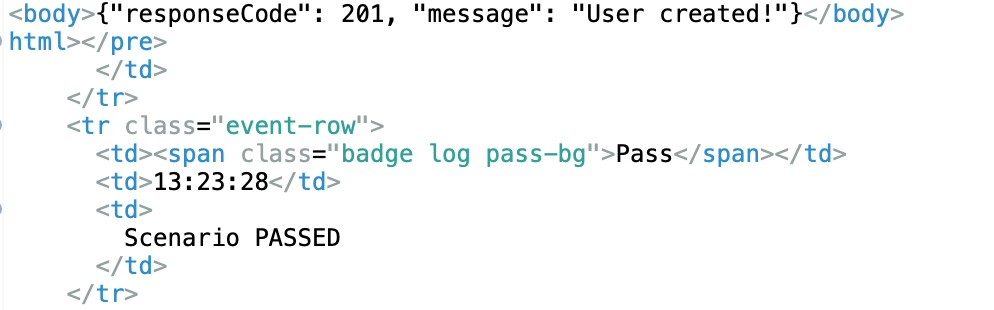

# Ecommerce UI & API Tests
A maintainable test automation framework for an e-commerce application, covering both UI flows (login, cart, checkout) and API validations.

# Features:
 - **UI Tests with Selenium + Cucumber + TestNG**
 - **API Tests with RestAssured / HTTP client**
 - **Page Object Model (POM) structure**
 - **Reusable utilities (waits, driver factory, reporting)**
 - **Parallel execution with TestNG**
 - **CI/CD process Jenkins**
 - **Test reports (TestNG HTML, ExtentReports)**

# Project Structure
src
 ├── main/java
 │    └── Utils          # DriverFactory, ReusableMethods
 ├── test/java
 │    ├── pages          # Page Object classes
 │    ├── stepdefinitions # Cucumber step defs
 │    └── runner         # TestNG runner classes
 └── test/resources
      └── features       # Cucumber .feature files

# How to Run
 - **Clone repo**
 - **git clone https://github.com/ozgemeva/ecommerce-ui-api-tests.git**
 - **cd ecommerce-ui-api-tests**
 - **Install dependencies (Maven project):**
-mvn clean install
-Run all tests:
-mvn test

# Example Scenarios
- **Login: user can sign up / login successfully**
- **login: user can sign up API / login successfully**
- **Register: user can sign up / login successfully** 
- **Register: create user API response**

### Test Reports
- **ExtentReport (recommended):** `/reports/ExtentReport.html`
- **TestNG Default Report:** `/test-output/index.html` (auto-generated)

# Reports
- **After test execution:  test-output/ contains TestNG HTML reports**
- **ExtentReports / Allure (if enabled)**
- ### 📊 Example Report (ExtentReports)

